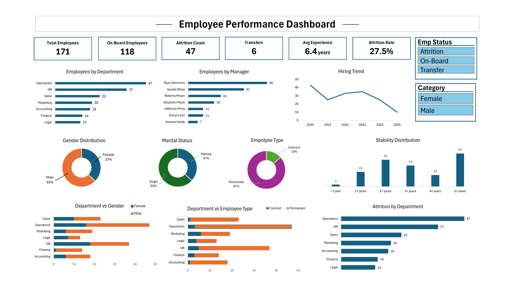

# Employee Performance Dashboard (Excel)

An interactive Excel dashboard designed to analyze employee performance, attrition, and workforce trends using pivot tables, charts, and slicers.

---

## Overview  

This dashboard provides insights into employee data, helping track key HR metrics such as attrition rate, employee distribution, hiring trends, and department performance. It enables quick analysis and supports data-driven decision-making in workforce management.

---

## Key Highlights  

- Analyzed employee data across departments and managers  
- Tracked attrition count and attrition rate  
- Visualized hiring trends over time  
- Compared employee distribution by gender, marital status, and type  
- Identified stability patterns based on years of service  
- Included interactive filters (employee status, gender) for dynamic analysis  

---

## Tools Used  

- Microsoft Excel  
- Pivot Tables  
- Charts  
- Slicers  

---

## Dashboard Preview  

---

## Project Files  

- [Employee Dashboard](./employee-performance-dashboard.xlsb)  
  Contains dashboard, raw data, and pivot-based analysis  

---

## Insights  

- Operations and HR departments have the highest employee count  
- Attrition rate is relatively high, indicating retention challenges  
- Majority of employees are permanent and male  
- Employee stability increases after 3+ years of experience  

---
